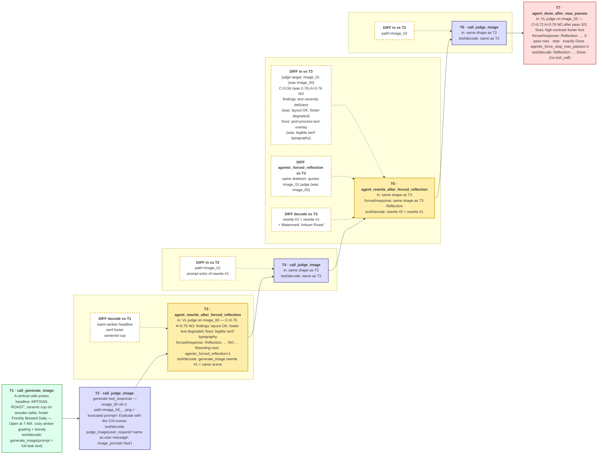

# Demo

Last updated: 08/17/2026

Note that as per PR1's schema, one noteworthy thing is that for `outputs/rollout_trajectories/step_0000xx/sample_xx.json`, the
fields `"turn_prompt"`, `"turn_obs"`, `"decode"`, and `"response"` are as below:
* agent llm input full
* agent llm input prompt extracted
* tool call input literally
* agent llm forced output, if it's forced reflection

The reason that we log all the inputs here only (no output) except for the forced agent llm reflection, is that in multi-turn scenarios, the inputs is basically coming from the body of the last turn output, thus to avoid duplication, we don't need to log every turn output.

```json
{
    "rollout_turns": [
        {
        "turn": 1,
        "turn_kind": "call_generate_image",
        "turn_obs": "A vertical artistic cafe poster. The headline at the top reads \"ARTISAN ROAST\". The center features a detailed, warm-toned illustration of a ceramic coffee cup sitting on a rustic wooden table with soft steam rising and gentle morning sunlight coming through a nearby window. Surrounding text at the bottom reads \"Freshly Brewed Daily — Open at 7 AM\". Cozy, warm amber and brown color grading, shallow depth of field, cozy aesthetic. Keep any private thinking to AT MOST one short paragraph (≤4 sentences).",
        "decode": "I will create a vertical artistic cafe poster as requested. I will start with a prompt that captures the cozy, warm aesthetic and detailed coffee cup on a wooden table, with morning light streaming through a window. I will then generate the image and immediately evaluate it for correctness, color grading, and composition before deciding on further refinements. I will keep the prompt concise and focused on the core elements, ensuring the final image meets the artistic vision. \n\n<tool_call>\n{\"name\": \"generate_image\", \"arguments\": {\"prompt\": \"A vertical artistic cafe poster. The headline at the top reads \\\"ARTISAN ROAST\\\". The center features a detailed, warm-toned illustration of a ceramic coffee cup sitting on a rustic wooden table with soft steam rising and gentle morning sunlight coming through a nearby window. Surrounding text at the bottom reads \\\"Freshly Brewed Daily — Open at 7 AM\\\". Cozy, warm amber and brown color grading, shallow depth of field, cozy aesthetic.\"}}\n</tool_call><|im_end|>",
        "response": "",
        "decode_has_tool_call": true
        },
        {
        "turn": 2,
        "turn_kind": "call_judge_image",
        "turn_obs": "user\n<tool_response>\nvLLM-Omni generated the requested image. path=rollout_images/step_000100/sample_5.04/image_00_95a3049231c9.png agentic_tool ok=1 stub=0 images=1 backend=vllm_omni prompt='A vertical artistic cafe poster. The headline at the top reads \"ARTISAN ROAST\". The center features a detailed, warm-toned illustration of a ceramic coffee cup sitting on a rustic wooden table with soft steam rising and gentle morning sunli' artifact=95a3049231c9 rollout=7c16a3e274693251\n</tool_response>\nassistant",
        "decode": "<tool_call>\n{\"name\": \"judge_image\", \"arguments\": {\"user_request\": \"same as user message\", \"image_prompt\": \"last\"}}\n</tool_call><|im_end|>",
        "response": "",
        "decode_has_tool_call": true
        },
        {
        "turn": 3,
        "turn_kind": "agent_rewrite_after_forced_reflection",
        "turn_obs": "user\n<tool_response>\nVL judge on the last generated image:\n  path=rollout_images/step_000100/sample_5.04/image_00_95a3049231c9.png\n  correctness=0.76\n  aesthetics =0.76\n  good_enough =NO\n  findings: The poster layout is perfect with the headline 'ARTISAN ROAST' at the top and the cup centered. However, the text at the bottom is severely degraded; the requested string 'Freshly Brewed Daily — Open at 7 AM' is not legi\n  suggested_fixes: Add a specific instruction for text legibility such as 'highly legible serif typography' or 'crisp, high-contrast text' to ensure the bottom text is readable. C\n  agentic_judge ok=1 parse_ok=1 stub=0 backend=vllm parse_retries=0\n</tool_response>",
        "decode": "<tool_call>\n{\"name\": \"generate_image\", \"arguments\": {\"prompt\": \"A vertical artistic cafe poster. The headline at the top reads \\\"ARTISAN ROAST\\\" in warm amber text. The center features a detailed, warm-toned illustration of a ceramic coffee cup sitting on a rustic wooden table with soft steam rising and gentle morning sunlight coming through a nearby window. Surrounding text at the bottom reads \\\"Freshly Brewed Daily — Open at 7 AM\\\" in a warm, inviting serif font. Cozy, warm amber and brown color grading, shallow depth of field, cozy aesthetic. The coffee cup is centered on the table, surrounded by soft morning light.\"}}\n</tool_call><|im_end|>",
        "response": "Reflection: VL judge reports correctness=0.76, aesthetics=0.76, good_enough=NO. The poster layout is perfect with the headline 'ARTISAN ROAST' at the top and the cup centered. However, the text at the bottom is severely degraded; the requested string 'Freshly Brewed Daily — Open at 7 AM' is not legi. Suggested fixes: Add a specific instruction for text legibility such as 'highly legible serif typography' or 'crisp, high-contrast text' to ensure the bottom text is readable. C. Rewriting the diffusion prompt next. agentic_forced_reflection=1\nassistant",
        "decode_has_tool_call": true
        },
        {
        "turn": 4,
        "turn_kind": "call_judge_image",
        "turn_obs": "user\n<tool_response>\nvLLM-Omni generated the requested image. path=rollout_images/step_000100/sample_5.04/image_01_11d7a5eb8147.png agentic_tool ok=1 stub=0 images=1 backend=vllm_omni prompt='A vertical artistic cafe poster. The headline at the top reads \"ARTISAN ROAST\" in warm amber text. The center features a detailed, warm-toned illustration of a ceramic coffee cup sitting on a rustic wooden table with soft steam rising and g' artifact=11d7a5eb8147 rollout=7c16a3e274693251\n</tool_response>\nassistant",
        "decode": "<tool_call>\n{\"name\": \"judge_image\", \"arguments\": {\"user_request\": \"same as user message\", \"image_prompt\": \"last\"}}\n</tool_call><|im_end|>",
        "response": "",
        "decode_has_tool_call": true
        },
        {
        "turn": 5,
        "turn_kind": "agent_rewrite_after_forced_reflection",
        "turn_obs": "user\n<tool_response>\nVL judge on the last generated image:\n  path=rollout_images/step_000100/sample_5.04/image_01_11d7a5eb8147.png\n  correctness=0.56\n  aesthetics =0.76\n  good_enough =NO\n  findings: The image successfully renders the primary subject (coffee cup on table) and the requested layout (headline top, footer bottom) with high aesthetic quality. However, the text generation is severely deficient. The headlin\n  suggested_fixes: Use a post-processing step to overlay the specific text strings 'ARTISAN ROAST' and 'Freshly Brewed Daily — Open at 7 AM' using a high-quality font, as the diff\n  agentic_judge ok=1 parse_ok=1 stub=0 backend=vllm parse_retries=0\n</tool_response>",
        "decode": "<tool_call>\n{\"name\": \"generate_image\", \"arguments\": {\"prompt\": \"A vertical artistic cafe poster. The headline at the top reads \\\"ARTISAN ROAST\\\" in warm amber text. The center features a detailed, warm-toned illustration of a ceramic coffee cup sitting on a rustic wooden table with soft steam rising and gentle morning sunlight coming through a nearby window. Surrounding text at the bottom reads \\\"Freshly Brewed Daily — Open at 7 AM\\\" in a warm, inviting serif font. Cozy, warm amber and brown color grading, shallow depth of field, cozy aesthetic. The coffee cup is centered on the table, surrounded by soft morning light. Watermark: \\\"Artisan Roast\\\".\"}}\n</tool_call><|im_end|>",
        "response": "Reflection: VL judge reports correctness=0.56, aesthetics=0.76, good_enough=NO. The image successfully renders the primary subject (coffee cup on table) and the requested layout (headline top, footer bottom) with high aesthetic quality. However, the text generation is severely deficient. The headlin. Suggested fixes: Use a post-processing step to overlay the specific text strings 'ARTISAN ROAST' and 'Freshly Brewed Daily — Open at 7 AM' using a high-quality font, as the diff. Rewriting the diffusion prompt next. agentic_forced_reflection=1\nassistant",
        "decode_has_tool_call": true
        },
        {
        "turn": 6,
        "turn_kind": "call_judge_image",
        "turn_obs": "user\n<tool_response>\nvLLM-Omni generated the requested image. path=rollout_images/step_000100/sample_5.04/image_02_0ee5b1bdeca9.png agentic_tool ok=1 stub=0 images=1 backend=vllm_omni prompt='A vertical artistic cafe poster. The headline at the top reads \"ARTISAN ROAST\" in warm amber text. The center features a detailed, warm-toned illustration of a ceramic coffee cup sitting on a rustic wooden table with soft steam rising and g' artifact=0ee5b1bdeca9 rollout=7c16a3e274693251\n</tool_response>\nassistant",
        "decode": "<tool_call>\n{\"name\": \"judge_image\", \"arguments\": {\"user_request\": \"same as user message\", \"image_prompt\": \"last\"}}\n</tool_call><|im_end|>",
        "response": "",
        "decode_has_tool_call": true
        },
        {
        "turn": 7,
        "turn_kind": "agent_done_after_max_passes",
        "turn_obs": "user\n<tool_response>\nVL judge on the last generated image:\n  path=rollout_images/step_000100/sample_5.04/image_02_0ee5b1bdeca9.png\n  correctness=0.72\n  aesthetics =0.76\n  good_enough =NO\n  findings: The subject entities (coffee cup, table, window) and scene context are perfectly rendered with high fidelity. The layout hierarchy is correct with the headline at the top and footer at the bottom. However, the text attri\n  suggested_fixes: Use a high-contrast, high-resolution font for the bottom text to ensure the full string 'Freshly Brewed Daily — Open at 7 AM' is rendered without truncation or \n  agentic_judge ok=1 parse_ok=1 stub=0 backend=vllm parse_retries=0\n</tool_response>",
        "decode": "Reflection: All attempts to render the text have failed due to poor text generation in diffusion models. Final decision: No further image generation. Done.<|im_end|>",
        "response": "Reflection: VL judge reports correctness=0.72, aesthetics=0.76, good_enough=NO after generate_image pass 3/3. The subject entities (coffee cup, table, window) and scene context are perfectly rendered with high fidelity. The layout hierarchy is correct with the headline at the top and footer at the bottom. However, the text attri 3-pass max reached; stop now and do not call another tool. Your next and only action must be exactly Done. agentic_force_stop_max_passes=1 agentic_stop_decision_required=1 agentic_forced_reflection=1\nassistant",
        "decode_has_tool_call": false
        }
    ]
}
```

# Larger flowchart with some styling

Multiturn tool calling + prompt rewriting for the cafe poster trajectory above
(JSON example). Each dump turn is an **agent LLM sample step**; diffusion /
VL-judge tools run **between** turns and appear as the next turn's `turn_obs`.

Per turn the chart shows:
1. `turn_kind`
2. `turn_obs` (agent input delta) and `decode` (policy sample / tool call)
3. `response` when forced reflection is injected (mask=0)

Adjacent duplicates are abbreviated as "same as above"; each DIFF is a
dashed box branching onto that turn. Live
`generate_image` prompts inside `decode` are **policy-sampled** (not parquet
fields). Parquet only stores system + optional fewshot + the live user task
(with brevity tail). Turn-1 `turn_obs` is backfilled from that last user
message when there is no prior tool response.





| |  |  |
| :-: | :-:| :-:|
| image_00 |  image_01 | image_02 | 