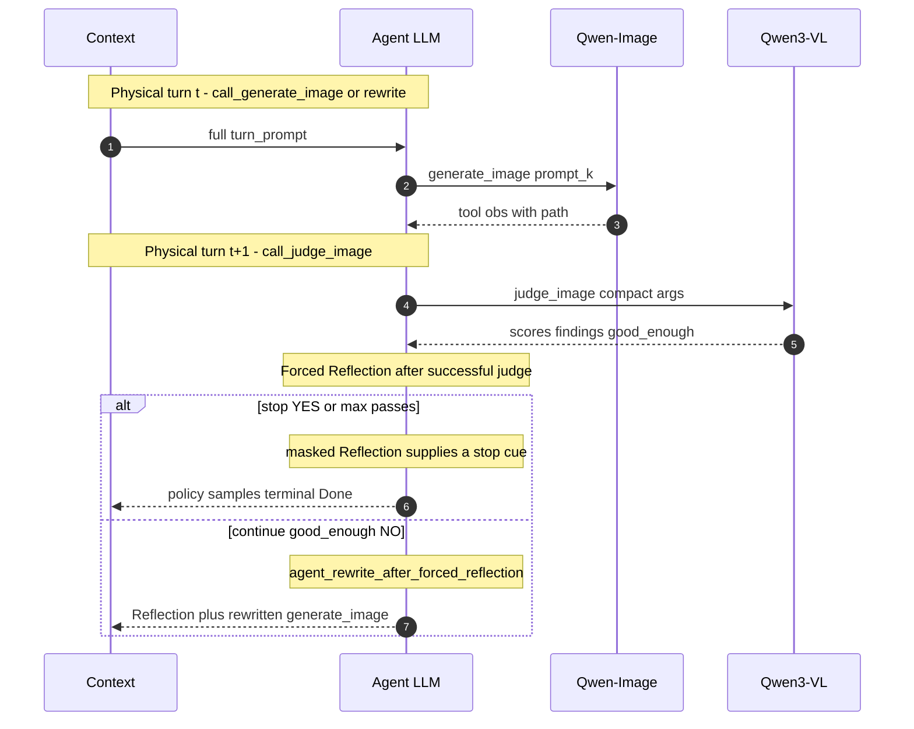

# Agentic LLM GRPO trainer

Last updated: 08/12/2026

Training recipes for **Agentic LLM RL** with GRPO ([#302](https://github.com/verl-project/verl-omni/issues/302)).
This folder covers the agent-LLM + frozen-tool loop (gen → judge → reflect / Done), not the full
Reflection–Plan Co-Optimization (RPCO) design from the RFC.
In this example, we conduct LoRA overfitting on this, where the Agent LLM, image
gen tool, and image judge can be **changed** as you need; this example uses:

- **Agent LLM** (`agent_llm/`): LoRA-train via `MODEL_PATH` (default `Qwen3-VL-2B-Instruct`; `Qwen3.5` also works).
- **Image gen** (`:8092`, `run_image_gen_tool_server.sh`): frozen diffusion — `generate_image` (model via `IMAGE_GEN_MODEL`, default Qwen-Image / vLLM-Omni).
- **Image judge** (`:8093`, `run_judge_image_tool_server.sh`): frozen VLM — live `judge_image`; reward prefers that C/A obs (model via `JUDGE_IMAGE_MODEL`, default Qwen3-VL).
- **Reward** (`agentic_reward`): Hermes/`<tool_call>` protocol + gated C/A + Done / ΔC (fewshot format must match the actor template).

Target protocol (fewshot + on-policy) — see **Multi-turn Behaviors** diagrams:

```
Turn k:
  1. generate_image(prompt_k) → image_k
  2. judge_image("same as user message", "last") → VL feedback
  3. forced Reflection (mask=0) then:
    YES / max-pass → stop cue → policy samples Done. (mask=1)   OR
    NO → policy rewrite + generate_image(prompt_{k+1}) → Turn k+1
```

Fewshot demos in `create_dummy_agentic_data.py` follow that order. They are
**GRPO exploration examples**, not supervised targets. Overfit fewshot omits the
terminal `Done.` so the live turn cannot copy Done-without-tools. Regenerate
parquet when switching actor family so fewshot `<tool_call>` syntax matches the
chat template.

## Rollout Trajectories

Each training step dumps per-rollout JSON under
`outputs/e2e/<run>/rollout_trajectories/step_XXXXXX/sample_{dataset}.{rollout_n}.json`
and matching PNGs under `rollout_images/…/sample_Y.ZZ/image_NN_<artifact_id>.png`.

Typical force-on trajectory (`AGENTIC_FORCE_REFLECTION_AFTER_JUDGE=1`):

| `turn_kind` | Meaning |
| --- | --- |
| `call_generate_image` | First (or non-forced) `generate_image` in `decode` |
| `call_judge_image` | Compact `judge_image` tool call |
| `agent_rewrite_after_forced_reflection` | Forced Reflection in `response` + rewrite `generate_image` in `decode` (**counts as a live gen**) |
| `forced_reflection_stop_cue` | YES → masked Reflection asks the policy to emit terminal `Done.` |
| `forced_reflection_max_passes_stop_cue` | Cap reached → masked stop cue (`agentic_force_stop_max_passes=1`) |
| `agent_done_after_forced_reflection` / `agent_done_after_max_passes` | Policy-sampled terminal `Done.` (**earns Done credit**) |

Do not grep only `call_generate_image` when counting images — rewrites after forced
Reflection use `agent_rewrite_after_forced_reflection` but still write PNGs.

## Reward components

`compute_score` returns a scalar `score` plus per-component fields. WandB
`agentic_reward/*` logs **only the scalar mix terms** (via
`agentic_metrics_manager.REWARD_COMPONENTS`):

- `agentic_reward/tool_call/{mean,min,max}`
- `agentic_reward/correctness/{mean,min,max}`
- `agentic_reward/aesthetics/{mean,min,max}`
- `agentic_reward/done/{mean,min,max}`

`reward_correctness` / `reward_aesthetics` prefer the last successful
`agentic_judge ok=1` observation already in the trajectory (same C/A the actor
saw). If absent, reward falls back to `AGENTIC_VLLM_URL` / legacy
`AGENTIC_REFLECT_VLM_URL`. Per-dimension facet fields may still appear in
`hermes_actions` JSONL but are **not** logged under `agentic_reward/*`.

**Overfit learning signal:** open `generate→judge` loops no longer keep a mid
plateau from high frozen-judge C/A. Scalar mix credits C/A fully only after a
successful PNG + successful judge + policy-sampled terminal `Done.`. A masked
forced Reflection may supply the reflection context, but never the terminal
action. Incidental prose such as “Stop when Done.” earns zero Done credit, and
blocked/no-PNG trajectories cannot close the protocol. The launch script sets LoRA `actor.optim.lr=1e-4`
(verl default `1e-6` was too small to move reward in 100 steps).


## Multi-turn Behaviors (three turns max)

**Target contract**:

1. Every logical turn starts with `generate_image(prompt_k)`.
2. In the **same** logical turn, after the image returns:
   - agent calls compact `judge_image` → frozen Qwen3-VL (`:8093`) returns structured feedback;
   - env injects masked Reflection (stop cue on YES/max-pass; continue on NO).
3. On a stop cue, the **next** physical turn is a policy-sampled `Done.` (`mask=1`).
   On NO, the policy rewrites `generate_image` in the same decision turn.
4. Branching stops at 1 / 2 / … / N gens (`AGENTIC_MAX_GENERATE_IMAGE_PASSES`,
   typically 3; tunable).

### Physical turns (trajectory JSON) vs one logical gen→judge→reflect

A **physical turn** is one entry in `rollout_turns[]` (`turn`, `turn_kind`,
`turn_prompt`, `turn_obs`, `decode`, `response`) — e.g. turn 3 in
`sample_1.02.json` with `turn_kind=agent_rewrite_after_forced_reflection`:
full chat prefix in `turn_prompt`, latest judge obs in `turn_obs`, forced
`Reflection:` in `response`, rewrite `generate_image` in `decode`.

One **logical** pass (generate → judge → decide) spans **2–3 physical turns**:

| Physical `turn` | Typical `turn_kind` | Policy `decode` | Env `response` |
| ---: | --- | --- | --- |
| *t* | `call_generate_image` (first) **or** `agent_rewrite_after_forced_reflection` | `generate_image(…)` | empty on first gen; forced `Reflection:` on rewrite turns |
| *t+1* | `call_judge_image` | `judge_image(same as user message, last)` | empty |
| *t+2* if YES / max-pass | `forced_reflection_stop_cue` / `forced_reflection_max_passes_stop_cue` then `agent_done_after_*` | policy `Done.` (or `Reflection: … Done.`) | masked stop cue in `response` |
| *t+2* if NO | `agent_rewrite_after_forced_reflection` | rewrite `generate_image(…)` | `Reflection: …` (then this turn is also gen *t* of the next logical pass) |

Example: physical 1=`call_generate_image`, 2=`call_judge_image`,
3=`agent_rewrite_after_forced_reflection`, …,
7=`forced_reflection_max_passes_stop_cue`, 8=`agent_done_after_max_passes`.



### What “turn input” must carry

| Logical turn | Input to agent decode that emits `generate_image` | Same-turn after image |
| --- | --- | --- |
| 1 | User task (+ system / fewshot) | VL judge(`image_1`) → stop cue → policy `Done.` **or** rewrite `prompt_2` |
| 2 | **Turn-1 reflection results** (VL summary + rewrite), not only the raw image obs | VL judge(`image_2`) → stop cue → policy `Done.` **or** rewrite `prompt_3` |
| 3 | **Turn-2 reflection results** | VL judge(`image_3`) → max-pass stop cue → policy `Done.` |

### Current rollout behavior

Each logical turn follows the contract above. Default for this overfit path is
force-reflection **on** (`AGENTIC_FORCE_REFLECTION_AFTER_JUDGE=1`):

- Turn k: `generate_image(prompt_k)` → compact `judge_image(...)` → **injected**
  `Reflection:` carrying the stop/continue verdict from `good_enough`
  (stop cue on YES / max-pass; else continue so the policy can rewrite).
  Injected tokens use `response_mask=0`. On a stop cue, the next turn is a
  policy-sampled `Done.` (`response_mask=1`) so GRPO receives real terminal credit.
- Cap successful generates with `AGENTIC_MAX_GENERATE_IMAGE_PASSES` (operator
  default **3**; launch fallback **5** — tune freely).
  `AGENTIC_BLOCK_GENERATE_AFTER_MAX_PASSES=1` also refuses further
  `generate_image` calls past the cap.
- **Env hard-stop (default on):** after `good_enough=YES`, further
  `generate_image` calls are refused (`agentic_block_generate_after_yes=1`).
- **Compact `judge_image` args:** prefer `user_request="same as user message"` and
  `image_prompt="last"`; the tool expands from the bound user task + latest
  artifact so long pasted args do not truncate Hermes tool calls.
- **YES bar (default 0.86):** `AGENTIC_JUDGE_GOOD_ENOUGH_THRESHOLD` /
  `AGENTIC_REFLECT_GOOD_ENOUGH` — YES iff `C≥thr` **and** `A≥thr` (model
  `good_enough` flag ignored). This yielded about 51% early first-pass YES at
  Qwen-Image STEPS=16, retaining both stop and rewrite exploration.
- **Image seeds:** `QWEN_IMAGE_SEED=42` with `QWEN_IMAGE_DIVERSIFY_SEED=1`
  (default) derives a stable per-rollout/per-pass seed so GRPO groups keep
  reward variance without fully randomizing images.
- **GRPO group size:** `ROLLOUT_N` defaults to **8**.
- Turn k+1 input is the prior tool obs + the forced Reflection (and any policy rewrite).

Set `AGENTIC_FORCE_REFLECTION_AFTER_JUDGE=0` only if you want the **policy** to
emit Reflection itself (max-pass stop cue + policy Done still apply).

### Rollout trajectory JSON protocol

Each ``rollout_trajectories/step_XXXXXX/sample_Y.ZZ.json`` lists ``rollout_turns``
with this key order:

| Key | Meaning |
| --- | --- |
| `turn` | 1-based index in the response tensor |
| `turn_kind` | Grepable stage label (see **Rollout Trajectories** table) |
| `turn_prompt` | Chat context / prior obs the policy conditions on for this decode |
| `decode` | Policy-sampled assistant tokens (`<tool_call>…` or prose) |
| `response` | Injected assistant text after the tool obs (forced Reflection when force=1) |
| `decode_has_tool_call` | `true` iff **`decode`** contains `<tool_call>` (ignores `response`) |

Important: **`decode` of turn T need not equal `turn_prompt` of turn T+1`.**
Fewshot demos in `create_dummy_agentic_data.py` match live tool obs (`path=` +
`agentic_tool` / `agentic_judge` markers; no `image_vis` or instructional
`REQUIRED NEXT ACTION` lines).

Each live `generate_image` writes directly to the matching
`rollout_images/step_XXXXXX/sample_Y.ZZ/image_NN_<artifact_id>.png` directory
while that rollout is running. ``artifact_id`` is a sha12 of
`(trajectory_relpath, index, prompt)` so concurrent same-prompt overfit
rollouts never collide in judge lookup. Trajectory dumps use the **same**
`sample_Y.ZZ` id:

| Dump | Images |
| --- | --- |
| `rollout_trajectories/step_S/sample_Y.ZZ.json` | `rollout_images/step_S/sample_Y.ZZ/` |

The JSON field `image_dir` is the absolute path to that folder; `image_paths`
lists PNGs found there. Both are empty when that rollout generated no image,
and post-processing does not create a meta-only image folder. Prefer
`image_dir` over guessing from `sample_index` alone — GRPO uses
`sample_{dataset_index}.{rollout_n:02d}` (e.g. `sample_6.00` … `sample_6.07`
are eight rollouts of the same prompt). The dumper stamps `trajectory_relpath`
from the live agent loop so dump names match `path=` markers in tool obs.

### Primary fields (enter the weighted mix)

| Field | Default weight | Physical meaning | Zero when |
| --- | ---: | --- | --- |
| `reward_tool_call` | 0.10 | Binary: trajectory contains ≥1 parseable `<tool_call>`. **In scalar.** | No parseable tool call |
| `reward_correctness` | 0.35 | Frozen-VL correctness (logged raw; **mix-gated** until closed). | URL unset / VL call fails |
| `reward_aesthetics` | 0.35 | Frozen-VL aesthetics (logged raw; **mix-gated** until closed). | URL unset / VL call fails |
| `reward_done` | 0.20 | Closed loop: successful PNG + successful judge + **policy-sampled** terminal `Done.` (forced Reflection may supply context; never the terminal). **In scalar.** | No policy terminal / blocked / no judge |
| `reward_delta_c` | 0.15 (additive) | Multiturn bonus: C lift after first `good_enough=NO` → rewrite → closed. Added as `w_delta_c * f_delta_c` on top of the mix. | First judge not NO / not closed / rewrite-after-YES |

Weighted mix (then scaled by a protocol tier `base + scale * mix`). C/A enter the
mix at full weight only after a closed policy terminal; open loops get 5% C/A:

```text
mix = Σ w_i * reward_i  /  Σ w_i   # tool_call, correctness, aesthetics, done
score = min(1, base + scale * mix + w_delta_c * reward_delta_c)
```

| Protocol tier | Condition | `base` | `scale` | `protocol_ok` |
| --- | --- | ---: | ---: | ---: |
| Closed + high C/A | policy terminal `Done.` (+ policy or forced Reflection context), single-pass or distinct rewrite, C/A ≥ 0.70 | 0.10 | 0.90 | 1 |
| Closed, VL down / weak C/A | closed loop; VL missing or C/A &lt; 0.70 | 0.05 | 0.65 | 1 |
| Reflection present | ≥1 `generate_image` + `Reflection:`, not fully closed | 0.04 | 0.30 | 0 |
| Gen-only (starved) | ≥1 `generate_image`, **no** closed terminal | 0.02 | 0.05 | 0 |

Weights are stored per row in parquet `ground_truth` / `extra_info` (`w_tool_call`,
`w_correctness`, `w_aesthetics`, `w_done`, `w_delta_c`).
### Visual rubric diagnostics

| Field | Physical meaning |
| --- | --- |
| `reward_correctness` / `reward_aesthetics` | Last `agentic_judge ok=1` C/A (or VL fallback) — **logged to WandB** |
| `reward_correctness_*` / `reward_aesthetics_*` | Optional per-dimension diagnostics in JSONL only (not WandB mix) |
| `protocol_ok` | 1 iff closed loop (policy terminal Done after gen+judge, single or distinct rewrite) |
| `num_hermes_tool_calls` | Legacy field name: count of parseable JSON/XML `<tool_call>` blocks |
| `num_generate_image_prompts` | Count of `generate_image` prompts |
| `num_judge_image_calls` | Count of `judge_image` tool calls in the trajectory |


## Judge Gate
```
VLM JSON
  → parse facets (or scalar C/A)
  → snap each facet to {0.0, 0.2, 0.4, 0.6, 0.8, 1.0}
       ([0.9, 1.0) → 0.8; only exact 1.0 stays 1.0)
  → rubber_stamp?
       raw C facets all identical & ≥0.9
       OR raw A facets all identical & ≥0.9
       OR (scalar-only) raw C≥0.9 and raw A≥0.9
     if yes: cap snapped facets at 0.8, annotate findings, stamp=1
  → C = mean(correctness facets), A = mean(aesthetics facets)
  → YES ⇔ (not rubber_stamp) AND C ≥ thr AND A ≥ thr
       thr = AGENTIC_JUDGE_GOOD_ENOUGH_THRESHOLD (default 0.80)
```


## Prerequisites

- Launch from the **verl-omni repo root** (repo-relative paths in the recipe).
- Set **`MODEL_PATH`** to a Qwen3-VL Instruct (or Qwen3.5) snapshot.
- Prefer **2–4 free GPUs** for GRPO, **2 GPUs** for Qwen-Image/Omni, **1 GPU** for the
  VL judge sidecar.
- Start the frozen image + VL judge sidecars before training; the launcher only
  checks that their URL env vars are set.

## 100-step overfit e2e (recommended)

Goal: overfit a tiny prompt pool so the policy learns
**`generate_image` → judge_image → (forced agent llm Reflection) → policy Done. or rewrite**.

### 1) Operator env (example)

```bash
source ~/fred/fred_verlomni_agentic_multiturn_pr1.sh   # or your local env
export CUDA_VISIBLE_DEVICES=4,5,6,7   # train GPUs; keep others for image + reflect
export MODEL_PATH=.../Qwen3-VL-2B-Instruct/...
export TRAIN_FILE=$PWD/data/agentic/train.parquet
export VAL_FILE=$PWD/data/agentic/val.parquet
```

### 2) Start frozen tools

Pane A — image gen (`generate_image`):

```bash
CUDA_VISIBLE_DEVICES=0,1 \
  bash examples/agenticllmgrpo_trainer/agent_llm/run_image_gen_tool_server.sh
# trainer: export AGENTIC_VLLM_OMNI_URL=http://127.0.0.1:8092
```

Pane B — image judge (`judge_image` + reward C/A fallback):

```bash
CUDA_VISIBLE_DEVICES=2 \
  bash examples/agenticllmgrpo_trainer/agent_llm/run_judge_image_tool_server.sh
# trainer: export AGENTIC_VLLM_URL=http://127.0.0.1:8093
```

Restart the image sidecar after changing `QWEN_IMAGE_STEPS` / CFG. Judge thr is
client-side (`AGENTIC_JUDGE_GOOD_ENOUGH_THRESHOLD`) and does not require a judge
restart.

Without an image service, `generate_image` returns a text stub. Set
`REQUIRE_REAL_IMAGE_TOOL=0` only for plumbing diagnostics.

### 3) Run GRPO — pane C

```bash
TOTAL_STEPS=100 \
  N_GPUS=4 \
  OVERFIT_DATA=1 \
  bash examples/agenticllmgrpo_trainer/agent_llm/run_agentic_grpo_lora.sh
```

| Step | Behavior |
| --- | --- |
| Template | Native tool template (Hermes for Qwen3-VL; XML for Qwen3.5) |
| Data | `TRAIN_FILE` / `VAL_FILE` (defaults: `data/agentic/{train,val}.parquet`) |
| Agent loop | `agentic_tool_agent` — forced Reflection stop cue + policy Done (default on); force-first gen curriculum |
| Tools | `diffusion_tool.py`: `generate_image` + `judge_image` |
| Observation | text tool obs (`path=`, judge C/A); sidecar VL scores PNGs |
| Reward | See tables above; prefer live judge C/A in traj |
| Artifacts | `outputs/e2e/<experiment>/{rollout_trajectories,rollout_images,hermes_actions}/` |

Inspect learning:

```bash
ls outputs/e2e/*/hermes_actions/
ls outputs/e2e/*/rollout_trajectories/step_*/
ls outputs/e2e/*/rollout_images/step_*/
```

### Data-only refresh (no train)

```bash
python3 examples/agenticllmgrpo_trainer/data_process/create_dummy_agentic_data.py \
  --local_save_dir data/agentic \
  --overfit --train_size 8 --val_size 2 \
  --with_fewshot --tool_call_format hermes
```

Each overfit row uses one of two prompts. With `OVERFIT_FEWSHOT=1`:

| Prompt | Fewshot |
| --- | --- |
| soldier (idx=0) | Class-1 two-pass same-task demo (ends on YES judge, no terminal `Done.`) |
| epic fantasy (idx=1) | system + user only (no baked demo) |

Non-overfit rows still cycle demo classes 0/1/2. Compact fewshot
`judge_image` args match live (`same as user message` / `last`).

Then the live user turn (with brevity reminder). Runtime calls remain on-policy.


## File map

```
examples/agenticllmgrpo_trainer/
├── README.md
├── agent_llm/
│   ├── run_agentic_grpo_lora.sh          # GRPO LoRA launcher (Hermes overfit)
│   ├── run_image_gen_tool_server.sh      # frozen image gen (default: Qwen-Image / vLLM-Omni)
│   ├── run_judge_image_tool_server.sh    # frozen image judge (default: Qwen3-VL / vLLM)
│   └── qwen_vl_judge_log_middleware.py   # optional sidecar C/A log lines
└── data_process/create_dummy_agentic_data.py

# Live multiturn path (builds on verl ToolAgentLoop / AgentLoopOutput / ToolResponse)
verl_omni/agent_loop/
├── agentic_tool_agent_loop.py            # ToolAgentLoop subclass: force-first / Reflection stop cue / policy Done
├── diffusion_tool.py                     # @function_tool generate_image + judge_image → ToolResponse
├── agentic_metrics_manager.py            # AgentLoopManager: traj/image dumps + WandB agentic_reward/*
├── agentic_manager_default.py            # wires agentic_tool_agent + metrics manager
└── agentic_trajectory_context.py         # rollout-scoped artifact paths / YES latch / image binding

verl_omni/utils/agentic_image_judge_parse.py  # VL judge: 0.2-grid snap + rubber-stamp gate (soft 0.8 cap, force NO)
verl_omni/utils/reward_score/
├── agentic_reward.py                     # scalar: tool_call + gated C/A + Done + ΔC
└── agentic_image_judge_client.py         # HTTP fallback when traj lacks agentic_judge ok=1
```

Upstream verl types used (not reimplemented here):
`ToolResponse`, `AgentLoopOutput`, `ToolAgentLoop` / `AgentData` — see `verl/experimental/agent_loop/` and `verl/tools/schemas.py`.

Frozen image backends in `diffusion_tool.py` (first match wins):

1. `AGENTIC_VLLM_OMNI_URL` — vLLM-Omni image generations
2. `AGENTIC_QWEN_IMAGE_URL` — bundled Qwen-Image HTTP service
3. `AGENTIC_DIFFUSION_TOOL_URL` — generic POST `{"prompt"}` → image/text
4. unset — text stub

Judge backends:

1. Live `judge_image` obs (`agentic_judge ok=1`) — preferred for reward C/A
2. `AGENTIC_VLLM_URL` — OpenAI `/v1/chat/completions` fallback
3. `AGENTIC_REFLECT_VLM_URL` — legacy FastAPI `/reflect`
4. unset / failure — C/A rewards 0.0 on fallback path
