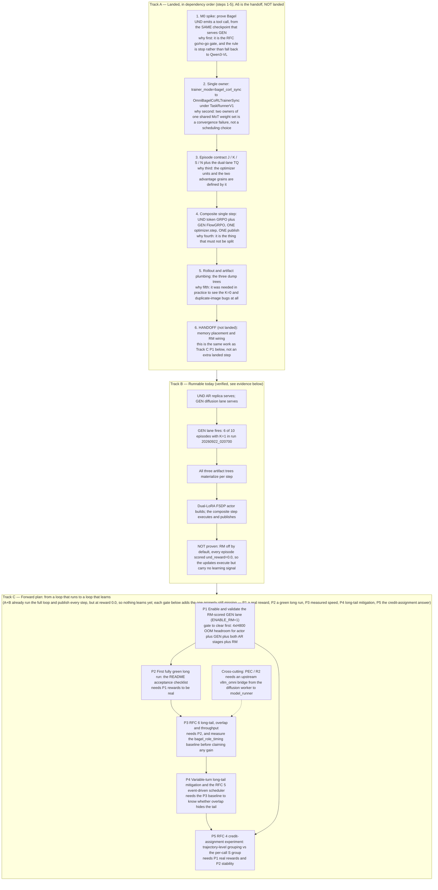

# RFC [#453](https://github.com/verl-project/verl-omni/issues/453#issuecomment-5596112929) — Point-by-Point Design Report

Authoritative source: the remote RFC *Multi-Turn Agentic Joint-Training on Bagel Gen with Und* (issue #453, comment `5596112929`), saved locally for review. This report maps each RFC Design-Summary subsection to the staged `bagel_corl` changeset in `verlomni-fredfork` and states what is implemented.

**Episode contract.** `J` = UND policy turns inside one episode (`EpisodeRollout.turns`); `K` = `generate_image` calls in that episode (`EpisodeRollout.num_gen_calls`), with `J >= K` enforced at pack time. `K = 0` episodes still contribute one UND row. `S` = `actor_rollout_ref.rollout.agent.gen_samples_per_call` (FlowGRPO seeds per call; fixed hyperparameter, must be ≥ 2). `N` = `actor_rollout_ref.rollout.n` sibling episodes per task.

**Dual LoRA + one optimizer step.** UND LoRA covers text projections/MLP; GEN LoRA covers `*_moe_gen` projections — disjoint sets on one `BagelForCoRL` FSDP module, one clip, one `optimizer.step()`, one weight publish after the N-sibling gather.

Status key: **Implemented** / **Partial** / **Not implemented** / **Deviates**.

# Verl-omni Meeting Summary

The rollout loop fans out N sibling episodes, each run serially by a per-episode loop under the Bagel Co-RL agent-loop worker: 

the UND autoregressive replica decodes policy turns until it emits Done or hits the turn/context cap (the realized count is J), a generate_image verdict triggers at most one GEN diffusion call of S FlowGRPO seeds, the reward model scores those samples, and a forced reflection closes the episode, with the UND and GEN rows split across the dual-lane transfer queue and no cross-episode or UND/GEN overlap yet, because the RFC's event-driven scheduler is not implemented. 

The two trainers are organized as one owner plus one borrowed lane rather than as two peers: 
the Co-RL sync trainer rooted in the PPO V1 TaskRunnerV1 is the only object that runs a training loop and takes the UND token-GRPO advantage from its parent, while PolicyGradientDiffusionTrainerV1 is never run as a trainer and instead lends its old-log-prob, reference-log-prob and advantage methods to a GEN lane bound onto the same actor-rollout worker under a copied config, 
so both lanes land in one composite backward pass and exactly one optimizer step

— and in dependency order we have closed the M0 spike, installed that single owner, defined the J/K/S/N episode contract with the dual-lane transfer queue, landed that composite single step, and built the three artifact dump trees that finally exposed the zero-generation and duplicate-image bugs, leaving memory placement and reward-model wiring as the open frontier.

## oneliner
OmniBagelCoRLTrainerSync: the V1 task runner drives a single registered `PPOTrainer` V1 trainer, and that trainer takes the UND token-GRPO advantage from its PPO V1 base class, while `PolicyGradientDiffusionTrainerV1` is never run as a trainer and instead lends its old-log-prob, reference-log-prob and advantage methods to a GEN lane bound onto the same actor-rollout worker under a copied config, so both lanes land in one composite backward pass and exactly one optimizer step.

## Noisy Rollout in GEN and Invalid Tool Calling in UND

Front-door summary of the two rollout-side defects (detail and evidence in the sections below and in Appendix A). Neither is a trainer or optimizer bug.

### Phenomenon

**GEN.** Generated images looked wrong/washed and were largely byte-identical across different prompts *and across separate runs*. In the scratch dir the GEN tool writes to (`/tmp/bagel_corl_gen/`), 42 PNGs held only **22 unique** files — eight groups of three byte-identical images written by three different runs (measured in-code; see Appendix A). Downstream this is not cosmetic: the `S` samples of one call are supposed to differ only by seed, so an identical group is a degenerate FlowGRPO group.

**UND.** The episode never registered its `generate_image` call: `K=0`, `gen_lane_skipped=True`, every turn kind `continue`, flat reward `0.0`, and the raw UND text showed a prose "plan" with no tool call. The lane looked like it was never wired, when in fact the call was being emitted and dropped.

### Main Causes

**GEN — three distinct causes, not one.** The fixed-seed reuse explains the *duplication*; it does not explain the *washed* appearance.

1. **Seeds (the duplication).** `BagelGenerateImageTool` hardcoded `seeds = list(range(self.s))` for *every* call in *every* episode, so calls reused seeds `0..S-1`. The bagel pipeline seeds its diffusion noise straight from `sampling_params.seed`, so a repeated seed is a repeated image. This is a correctness bug, not a cosmetic one: a no-variance group gives the group-relative advantage nothing to normalize against.
2. **Denoise budget (the washed look).** The rollout ran at `GEN_STEPS=10` (the 1-GPU branch at `4`) against the canonical `15` in `flowgrpo_trainer/bagel/run_bagel_{ocr,pickscore}_lora.sh`, i.e. too few steps to finish denoising.
3. **SDE window.** `sde_window_range` was not clamped to the real denoise-step count, so on low-step configs the window could be drawn *past the whole schedule* and silently record no noise/log-probs at all. Separately, validation inherited the training `noise_level=0.7` **and** `GEN_STEPS`, so val images were degraded and stochastic (not reproducible). Note `noise_level > 0` at *training* time is required and correct (the SDE window must record log-probs); it is only wrong for validation.

**UND — three causes.** (1) `parse_und_tool_call` read only the *first* fenced JSON block, so a `generate_image` call sitting in a later fence of a multi-step plan was taken for prose. (2) Dialect: this checkpoint's most common call shape is `<tools>{…}</tools>` behind a prose plan, *not* the Hermes `<tool_call>` the RFC names. (3) Sampling: repetition loops drove the degenerate AR behaviour in which the model loops `continue` and never emits a call.

### Solutions

**GEN.** Seeds are now derived per episode **and** per call: `_default_seeds(call_index) = derive_rollout_seed(seed_base, call_index*S + i)`, and the hardcoded `range(S)` is gone. The episode-scoped base had to be fixed **twice**: the first attempt used `seed_base = derive(seed or global_steps, session_id)`, but `session_id` is only the rollout *sibling* index (0..N-1), so it is unique within a task and nowhere else — every task's sibling 0 shared it, leaving exactly `N` seed bases for a whole step. Measured 2026-09-22 on `20260922_025201` step 60: 740 PNGs under two seed families only (`derive(derive(60, 0|1), i)`), so ~370 distinct prompts were re-denoised onto two noise draws and repeated prompts returned near-identical images. `episode_artifact_keys` now folds in the per-task `dataset_task_uid` (`crc32(f"{uid}:{session_id}")`, deterministic, not the salted builtin `hash`), and it also derives the artifact path — `sample_index` carries the dataset sample and `session_id` goes to `rollout_n`. `GEN_STEPS` is raised to the canonical `15` on the ≥2-GPU branches (the 1-GPU `4` stays a memory concession, not a quality target), and `val_kwargs` is pinned to `num_inference_steps=50` / `noise_level=0.0`. `sde_window_range` is clamped to the real step count, and `build_gen_sampling_params` now lets the worker's per-phase `base` win so the val overrides actually reach the diffusion request (they were previously dead). The rollout SDE settings themselves (`noise_level=0.7`, `sde_window_size=2`, window `[0,7]`) already matched the canonical `run_bagel_ocr_lora.sh` and were left alone.

**UND.** The parser scans *every* fence (`_FENCED_BLOCK_RE.finditer`) with the label bound measured per block, and accepts four dialects. Rollout sampling is pinned to temp `0.7` / top_p `0.9` / top_k `50` / repetition_penalty `1.05` to suppress the loops.

**Evidence — and a correction.** An earlier revision of this report claimed the duplication was solved on the strength of "32 PNGs, all 32 unique". That was wrong: the per-step uniqueness check passed only because the *folder collision* had hidden the duplication, and `step_000060/sample_0.01` alone held **646–830 PNGs** while being written (830 by the time the run was stopped; it grew by ~100 files between two counts 40 minutes apart) under a **single** seed base `s60000360`, with 2 trajectory files where ~370 episodes had overwritten each other. Hashing that folder gave **624 distinct md5 out of 646** and **32 pixel-identical pairs (`maxdiff=0`)**, i.e. whole episodes re-denoised onto another episode's noise draw. What is actually verified now, by re-running the fixed recipe end to end (`bagel_corl_20260922_052330`, GPUs 2-5): every artifact folder is **one episode** (`rollout_images/step_000001/sample_<dataset_task_uid>.<sibling>/`), the 6 PNGs of step 1 are **6/6 unique** by md5, and each episode carries a *distinct* seed base — `s2361848234523447…`, `s4223669997971982…`, `s1079581108733611…` for sibling 0 of three different tasks — against the broken run where one folder's 740 PNGs shared the **single** base `s60000360`. Image statistics are in normal range (std 34–57, unique colours 95k–198k, saturation 22–37), i.e. the prompt-specific content survived rather than collapsing onto one draw. CPU-side, 6/6 test episodes yield distinct paths and distinct seed bases (`test_two_tasks_at_the_same_sibling_index_do_not_collide`) and `degenerate_und_turns=0` in every episode that fired. **Caveats:** the fix has not yet completed a run, and the trajectory's `num_gen_calls` under-counts GEN activity, so any `K=0` reading must be cross-checked against its image folder.

### Relationship between GEN and UND for these two issues

**Independent root causes — no direct causation.** Different files, different mechanisms; the seed bug did not cause the parse failure and vice versa.

**One shared class:** both were *silent fallbacks* that never raised — the parser fell back to "treat it as prose", the seed code to "use the constant range".

**One shared symptom, and the correlation that matters:** *both independently produce a zero-advantage GEN lane.* Duplicate seeds give every member of the `S`-group the same reward, so the group mean equals each member and the advantage is identically zero; a `K=0` parse failure produces no GEN row at all. Consequently **fixing either one alone would not have restored a GEN learning signal** — the UND parser fix is what makes GEN calls fire, and the seed fix is what makes the resulting group informative. That is the real coupling: they are a prerequisite pair for a live GEN gradient.

**The seed defect itself needed two fixes, and only the first was in this report's original scope.** Removing the constant `range(S)` made the *within-call* seeds distinct, but the *episode* key driving the base was degenerate (`session_id`, shared by every task's sibling 0), so distinct prompts across a step still landed on the same handful of draws. Duplication therefore has two independent layers — intra-call (constant range) and cross-episode (collapsed base) — and the second is the one that survived the first fix and produced the 740-PNG folder. Any future claim that "the duplicate-image issue is solved" must state which layer it means.

**An observability coupling.** Neither was visible in the training row (it carried no seeds and no raw UND text); both only became diagnosable once the three artifact dumps (`rollout_images`, `rollout_trajectories`, `hermes_actions`) landed — which is why the dumps were built before these fixes. The UND fix also *exposed* the seed bug: once `K>0`, GEN calls actually fired and the duplication became a training problem rather than a latent one.

**Both remain rollout-side and partially verified:** no fully green long run has completed, and the `num_gen_calls` under-count is unresolved.

## Development timeline and current state

The diagram reads left-to-right as three tracks: what landed and **why it landed in that order**, what runs today, and what is next. Each arrow is a real dependency, not a schedule.

**How to read it — "runnable" has two senses here, and Track C gates only the second.** This is the one place the diagram is easy to misread, so it is stated before the reader hits it:

- **Machinery runs (Track B, verified).** The actor builds, the UND AR replica and the GEN diffusion lane both serve, episodes take real multi-turn `generate_image` trajectories, all three artifact trees materialize per step, and the composite step executes, publishes, and advances `global_step` — ~30 steps at ~55 s/step in the current run.
- **Learning does not yet happen (Track C P1's gate).** With the RM lane off, every reward is `0.0`, so every advantage is `0.0` and `actor/grad_norm: 0.0` / `perf/mfu/actor: 0.0`. The optimizer steps, on a zero gradient.

Track C is *by construction* not implemented — it is labelled "Forward plan", and nothing in it should be read as landed. That does **not** mean the design is unrunnable: Track A/B are the landed and running machinery, and Track C is the sequence of gates that turns the running harness into a *learning* one. Track A's step 6 is the single item in that list that is both unlanded and currently duplicated as C1, so the two are the same work seen twice — see the note under the diagram.

**A6 and C1 are the same work, listed in two places.** Track A's step 6 ("memory placement and RM wiring") and Track C's P1 ("enable and validate the RM-scored GEN lane") describe one task. It appears in Track A because it was *recognised* as the frontier while the earlier steps were being closed, and in Track C because nothing can start until it is green. It is the only item in Track A that is not landed; steps 1–5 are. Read Track A as "landed 1–5, handing off at 6", not as "an unfinished track".

**Why the artifact-dump and rollout fixes were not premature work ahead of Track C.** They are defects in Track A steps 3–5 — the already-landed GEN lane — not Track C features, and they had to be fixed for P1 to be *measurable at all*:

- The dumps (step 5) are what made the bugs visible. Before them nothing in the training row carried seeds or raw UND text, so `K=0` and byte-identical images were invisible; the dumps are how both were found.
- The duplicate-seed defect is fatal to exactly the quantity P1 is supposed to turn on. FlowGRPO's advantage is group-relative across the `S` seeds of one call; if all `S` are the same draw they receive the same reward, the group mean equals every member, and the advantage is **identically zero**. Enabling the RM lane on top of that would have produced `rm_score` values that were present, non-null, and *still* yielding a zero GEN gradient — the worst failure mode available, because it looks like success in every log line and would have been misdiagnosed as an RM-wiring problem. The seed fix is therefore a precondition for P1's result to mean anything.
- The `parse_und_tool_call` fix is the same argument one step earlier: no parsed call means no GEN row at all, so no `rm_score` to speak of.

The ordering was consequently: land the lane (A1–A5) → instrument it → fix the two rollout defects that made its output degenerate → *then* turn on the reward (P1). Fixing the images first is what makes the next run's `rm_score` a real measurement rather than another zero.

**Ordering rationale vs. the real commit order.** The order above is the dependency order, and the commits group by milestone rather than following it one-to-one. `7b3b7c1` (2026-09-03, "init commit for bagel corl") is a big-bang: it already carries `register_trainer("bagel_corl_sync")` / `OmniBagelCoRLTrainerSync`, `bagel_composite_loss`, `composite_forward_mode`, `spike_und_hermes.py` and the dual-lane TQ key helpers, so steps 1, 2 and 4 co-landed. Then `90bb7c7` (2026-09-03) reuses the agentic RPCO scaffolding, `02acb7c` (2026-09-09) wires the dual-lane TQ, `5f5d61d` (2026-09-09) fixes the TQ GEN-fetch silent drop and the K=0 zero-reward bugs and wires the GEN/RM stubs, `c98a838` (2026-09-11) lands the dual-lane TQ plus agentic PR batch, and `21f0d5c` / `ab9a1bd` / `318bc32` / `47c63d8` (09-12 → 09-15, "rfc-design-aligned") refine it. Everything this report cites as newest — the four-dialect `parse_und_tool_call`, the per-episode/per-call seed derivation, the three `dump_episode_*` trees and `run_dir` — is **staged on top of `47c63d8`, not committed**: `git status` shows 45 files all staged with no unstaged changes, and `git show HEAD:…` returns zero matches for those symbols. Track A step 5 (dumps) and the parser/seed fixes are therefore the most recent work, and they were debugging-driven rather than planned.

**Runnable today (verified).** In `outputs/bagel_corl_20260922_020700/e2e/bagel_corl_pr1/`: 5 steps of `rollout_trajectories/`, `rollout_images/` and `hermes_actions/` exist; 6 of 10 episode dumps show `num_gen_calls=1`, `gen_lane_skipped=false`, `turn_kind_counts={'generate_image': 1}` with `degenerate_und_turns=0`, i.e. the UND AR replica served a real tool call and the GEN diffusion lane fired. The remaining 4 episodes are K=0 all-`continue` loops, so the loop is not yet reliable, only functional. `rollout_images` holds 30 PNGs, all 30 unique. The newest run, `outputs/bagel_corl_20260922_025201` (the 4-GPU relaunch), is the first to exercise the **staged flat layout**: `rollout_trajectories/`, `rollout_images/` and `hermes_actions/` all sit directly under the run dir with no `e2e/<experiment>` level, 4 steps deep, with per-episode `sample_<id>.01/` folders and a `hermes_actions/step_*.jsonl` whose `image_dir` resolves into that same flat tree. That makes `run_dir` + the three dumps validated end-to-end by a real run rather than by a CPU test.

**Not yet runnable or proven.** `ENABLE_RM=0` is the default on the 1/2/4-GPU branches, so there is no RM handle: `build_gen_flowgrpo_proto` returns `None`, `skip_gen=True`, and every one of the 10 dumps above records `und_reward=0.0`. The composite step therefore *executes* (4 rollout dumps are only reachable if the preceding update cycles completed) but with an identically zero advantage, which is a zero-gradient update, not a learning step; the run's own `main_omni.log` is 0 bytes, so `actor/grad_norm` could not be re-read to confirm. No run has yet met the README acceptance checklist, and RFC §6 overlap/MFU is unmeasured.

**How the RM lane is turned on (wired 2026-09-22, not yet run).** `ENABLE_RM=1` alone is *not* sufficient, and assuming it was is what kept this lane inert: the RM pool only carries the in-loop handle, while `bagel_rm_image_scorer` gets its C/A numbers from the frozen VL judge over HTTP (`agentic_image_judge_client.call_reflect_vlm` -> `post_vllm_chat` -> `{vllm_url}/v1/chat/completions`). With `agentic_image_gen.vllm_url` left at its schema default of `""`, the scorer fails loud rather than zero-filling, so `ENABLE_RM=1` without a reachable judge only converts a silent all-zero reward into a mid-episode crash. The recipe now therefore defaults `JUDGE_SERVER=$ENABLE_RM`, which starts `run_judge_image_tool_server.sh` on `JUDGE_GPU` (the last visible device, i.e. the emptiest GEN rank) and proves `/v1/models` answers *before* Ray comes up, then forwards `agentic_image_gen.vllm_url` and `good_enough_threshold`. The sidecar launcher needs three things that the trainer's own launch does not, each found the hard way and now set explicitly: the middleware's directory on `PYTHONPATH` (vLLM loads it by module path and it is not importable from the repo root), the venv's `bin` on `PATH` (the sidecar `exec`s a bare `vllm`, and the recipe never activates the venv), and the same `cuda-compat` `LD_LIBRARY_PATH` shim (a second torch process on a CUDA 12.2 driver with a cu13 venv). Exercised end to end on GPU 5 with a 2B stand-in judge: launch, readiness gate, `/v1/models`, and the exit trap all behaved. Note the agent-facing `judge_image` tool is a red herring in this lane — `bagel_corl_lib` lists it in `_INERT_BARE_TOOLS`, so the reward rides the RM handle and this sidecar is the only thing that produces a score.

## Status summary

| RFC point | Status | Code | Tests |
| --- | --- | --- | --- |
| §1a Entrypoint / one owner | Implemented | `verl_omni/trainer/main_omni.py`; `verl_omni/trainer/omni/bagel_corl_trainer.py` (`OmniBagelCoRLTrainerSync`) | `test_register_bagel_corl_sync` |
| §1b Library composition | Implemented | `verl_omni/trainer/omni/bagel_corl_diff_v1.py`, `bagel_corl_gen_adv.py` | `test_diffusion_v1_gen_lane_binds_v1_hooks` |
| §2 Non-goals | Partial (config/doc-level) | `verl_omni/utils/config.py`, `bagel_corl_trainer.py` | `test_qwen_und_forbidden`, `test_output_mode_ar_alone_rejected` |
| §3 Composite step, J/K/S/N | Implemented (GEN inert without RM) | `verl_omni/agent_loop/bagel_corl_tq.py`, `verl_omni/workers/engine/fsdp/bagel_corl_composite.py`, `verl_omni/workers/utils/losses.py` (`bagel_composite_loss`) | `test_composite_loss_und_plus_gen_separate_views` |
| §4 Credit-assignment alternative | Not implemented | `verl_omni/utils/config.py` (S ≥ 2) | `test_seeds_s_must_be_at_least_two` |
| §5 Pattern gate / event-driven scheduler | Gate Implemented; scheduler Not implemented | `bagel_corl_tq.py`; `bagel_corl_lib.run_serial_episode` | `test_pattern_*`, `test_gate_rejects_j_lt_k` |
| §6 Long-tail / MFU | Not addressed / unmeasured | `bagel_corl.py` (`bagel_role_timing`), `tools/monitor_bagel_rollout.py` | none |
| §7 Data flow per step | Implemented | `bagel_corl_lib.flatten_multiturn_rollouts`, `und_episode_rm_scores` | `test_flatten_*`, `test_the_und_reward_lands_on_the_last_trainable_token_not_a_masked_tail` |
| Artifact dumps (three trees) | Implemented | `verl_omni/tools/trajectory/paths.py`, `bagel_corl.py` (`dump_episode_*`), `verl_omni/utils/agentic/image_gen_rollout_dump.py` | `test_bagel_corl_trace_dump_on_cpu.py`, `test_bagel_corl_gen_image_dump_on_cpu.py` |
| R2 conditioning reuse (§4.4.2/4.4.4) | Partial — counters/cache unserviceable in pinned `vllm_omni` | `verl_omni/workers/rollout/vllm_rollout/vllm_omni_async_server.py` | `test_unserviceable_stats_return_no_counters_and_latch_once` |
| Spike slice (UND Hermes tool-call) | Implemented | `examples/agenticllmgrpo_trainer/bagel/spike_und_hermes.py`, `tools/probe_und_{loop,health,prompt_ab}.*` | n/a (live-replica scripts) |

## 4.1 Entrypoint and ownership

**Implemented.** The public entry is `python3 -m verl_omni.trainer.main_omni` (`verl_omni/trainer/main_omni.py`, Hydra config `omni_trainer`). `run_omni` sets `trainer.use_v1=True` and delegates to `verl.trainer.main_ppo.run_ppo(config, task_runner_class=TaskRunnerV1)`; `validate_omni_config` runs `validate_bagel_corl_config`. Registration is `@register_trainer("bagel_corl_sync")` on `OmniBagelCoRLTrainerSync(OmniPPOTrainerSync)` in `verl_omni/trainer/omni/bagel_corl_trainer.py`, imported via `verl_omni/trainer/omni/__init__.py` (test `test_register_bagel_corl_sync`).

`_rewrite_bagel_corl_configs` retargets the model node to `DiffusionModelConfig` (`model_type=diffusion_model`, `composite_mode=bagel_corl`, `algorithm=flow_grpo`), the rollout node to `DiffusionRolloutConfig`, and injects `actor_rollout_ref.actor.diffusion_loss`; `_init_resource_pool_mgr` swaps in the omni `ActorRolloutRefWorker`. One owner, one optimizer, one `policy_version`.

`_ensure_dual_role_rollout` builds a standalone UND AR replica (`_build_und_ar_entrypoint_config`, `output_mode=ar`, deploy `bagel_corl_deploy_ar.yaml`), colocates it on the actor PG via `split_resource_pool`, registers it on the shared `checkpoint_manager`, and wraps UND+GEN behind `BagelDualRoleLLMServerClient` (`verl_omni/workers/rollout/bagel_dual_role_llm_server.py`); `get_llm_client()` returns that client.

**Deviates.** The RFC *prefers* one vLLM-Omni deployment serving both roles and allows "two colocated replicas of the same checkpoint" as fallback. Only the fallback is implemented: UND is a second, separately-configured replica; GEN keeps `bagel_corl_deploy_tp2.yaml` / `bagel_corl_deploy.yaml`.

**Guards.** `und_ar_serving_ready=True` plus `und_deploy_config` are required; `output_mode=ar` alone and a Qwen3-VL UND path are rejected. Weight publish uses one shared `checkpoint_manager`; `on_step_end` publishes and then `_wake_und_rollout_replicas` wakes AR (`weights`+`kv_cache`), because the naive backend wake reaches only the actor's own GEN server (tests `test_on_step_end_wakes_the_und_ar_replica_after_the_gen_publish`, `test_on_init_end_…`, `test_on_validate_end_…`).

## 4.2 Composition of `TaskRunnerV1` and diffusion-v1 helpers

**Implemented as library composition, not dual jobs.** `DiffusionV1GenLane` (`verl_omni/trainer/omni/bagel_corl_diff_v1.py`) `__get__`-binds `PolicyGradientDiffusionTrainerV1._compute_old_log_prob` / `_compute_ref_log_prob` / `_compute_advantage` onto the *same* `actor_rollout_wg`. `_lane_config_with_gen_estimator` gives the lane a deep-copied config whose `algorithm.adv_estimator` is the GEN estimator (`_gen_adv_estimator`: `algorithm.gen_adv_estimator` → `model.algorithm` → `flow_grpo`), so the UND token estimator never leaks into GEN. Test: `test_diffusion_v1_gen_lane_binds_v1_hooks`.

UND stays PPO V1: `_compute_advantage` ends in `super()._compute_advantage` (estimator `algorithm.adv_estimator`, omni default `grpo`) over UND TQ keys, and `bagel_composite_loss` → `ppo_loss`.

GEN: `_compute_old_log_prob` calls the lane on `build_gen_flowgrpo_proto(gen_rows)` and stashes `extra["bagel_corl_gen_old"]`; `_compute_advantage` calls the lane (or `apply_gen_flowgrpo_advantage` without a worker group) and writes `extra["bagel_corl_gen"]` only. Both require `all_latents` and refuse a logprobs-only soft path. Tests: `test_compute_advantage_without_worker_group_uses_helper`, `test_build_gen_proto_packs_traj_for_diffusion_engine`, `test_gen_adv_estimator_rejects_token_grpo_collision`.

GEN actor forward is the diffusion V1 `PPODiffusersFSDPEngine` selected by `composite_forward_mode` (`gen_only_diffusion` / `und_infer` / `composite_train`) in `verl_omni/workers/engine/fsdp/bagel_corl_composite.py`.

**Gaps.** (1) `_compute_ref_log_prob` is bound but the recipe enables no reference/KL loss, so that lane is unused today. (2) GEN old-logprob/advantage need a live traj stash *and* an `rm_score`; with `ENABLE_RM=0` no RM handle exists, so `build_gen_flowgrpo_proto` returns `None` and `skip_gen=True` — the README documents this as deliberate plumbing mode, not a bug.

## 4.3 Explicit non-goals for the trainer process

**Partial — enforced by config and docs, not by an assertion.** The RFC forbids calling `PolicyGradientDiffusionTrainerV1Sync.fit()` and registering a second diffusion trainer mode. Only `bagel_corl_sync` is registered (`test_register_bagel_corl_sync`); `OmniBagelCoRLTrainerSync` invokes `super()` PPO V1 methods and the GEN lane never calls `fit()`. Nothing in code *prevents* a caller from instantiating the diffusion trainer directly — this non-goal is documentation plus recipe convention.

The RFC forbids running `verl.trainer.main_ppo.TaskRunnerV1` and `main_diffusion_v1` as two Ray jobs. `run_omni` still routes online RL through `TaskRunnerV1`, and `main_diffusion_v1` is untouched. Again not machine-enforced: launching both remains possible.

One colocated `ActorRolloutRefWorker` owns the FSDP module, both LoRA groups, one optimizer and one monotonically increasing `policy_version` (`_init_resource_pool_mgr`, `_ensure_dual_role_rollout`; `policy_version` comes from `sampling_params["global_steps"]` in `bagel_corl.py`). Either rollout topology receives one publication in `on_step_end`.

`docs/start/diffusion_v1.md` is not the launch path — this is a documentation change only.

Additional fail-closed guards the RFC asks for are implemented in `verl_omni/utils/config.py::validate_bagel_corl_config`: Qwen3-VL UND rejected, `output_mode=ar` alone rejected, `S >= 2` and `max_generate_passes == 1` required, `und_ar_serving_ready`/`und_deploy_config` required, PEC affinity-without-cache rejected, and the rollout/data length contract enforced. In `_und_decode` a UND decode that lands on the diffusion replica or returns `DiffusionOutput` raises rather than leaving TQ empty.

## 4.4 Composite step contract after N siblings finish

**Implemented.** Dual-lane TQ (`verl_omni/agent_loop/bagel_corl_tq.py`): one UND key per episode (`und_tq_key`) and per-seed GEN keys (`gen_tq_key`); `put_dual_lane_rows` issues one `kv_batch_put` **per lane** because the schemas are disjoint, and GEN rows carry `tag.is_auxiliary=True` so the replay sampler never samples them (`test_the_two_lanes_are_written_in_separate_puts`, `test_gen_rows_are_tagged_auxiliary_so_the_sampler_skips_them`).

- UND old log-prob: PPO V1 token path; `run_und_token_forward_backward` → `BagelForCoRL.compute_und_log_prob`, published as jagged nested `log_probs`/`entropy` (`postprocess_und_batch`).
- GEN old log-prob: the bound lane, only when the GEN proto is non-None and carries `all_latents`/`timesteps`/`rollout_log_probs`.
- Advantages: token GRPO on UND via `super()._compute_advantage`; FlowGRPO on GEN grouped by `gen_group_uid` into `extra["bagel_corl_gen"]` only. Colliding UND/GEN estimators raise.
- Loss: `bagel_composite_loss` = UND `ppo_loss` (÷ `gradient_accumulation_steps`) + GEN `diffusion_loss`, scaled by `loss_weight_und`/`loss_weight_gen`; `skip_gen` makes the GEN branch a no-op; `gen_regularizer='velocity_mse'` raises `NotImplementedError` (`latent_kl` default). Tests: `test_composite_loss_und_plus_gen_separate_views`, `test_composite_loss_applies_lane_weights`, `test_composite_loss_skips_gen_without_complete_groups`.
- One step: `_update_actor` → `super()._update_actor` → one `forward_backward_batch`, one clip, one `optimizer.step`, one publish.

J/K/S/N: `gate_episode_jk` raises when `J < K`; `episode/J`, `episode/K`, `episode/pattern_*` are published. `S >= 2` and `max_generate_passes == 1` are launch-validated; the retired `rollout.n == 2 * gen_samples_per_call` equality is explicitly allowed to fail (`test_sibling_n_need_not_equal_two_s`, `test_retire_n_eq_two_s_config_gate`).

**Caveat.** The GEN half trains only when complete S-groups carry `rm_score`; with `ENABLE_RM=0`, `skip_gen=True` on every step and only the UND lane updates.

## 4.5 Open credit-assignment question

**Per-call `S`-group is implemented; the trajectory-level alternative is not, and no experiment exists.** `validate_bagel_corl_config` rejects `S < 2` (a singleton FlowGRPO group has an identically zero advantage — the RFC cites the `diffusion_algos` singleton branch), and `apply_gen_flowgrpo_advantage` / `build_gen_flowgrpo_proto` group strictly by `gen_group_uid`. Tests: `test_seeds_s_must_be_at_least_two`, `test_flowgrpo_uid_is_gen_group`, `test_jxk_ids_never_group_flowgrpo_across_und_prompts`.

The coarse alternative the RFC records — `S = 1`, one episode as one unitary path, every action taking the N-sibling advantage with an explicit return normalization — is **not implemented and not reachable**: `S >= 2` is a hard launch gate, there is no return-normalization code (`sample_level_rewards` is the per-seed score expanded over timesteps, not an episode return), and the GEN proto requires a per-row `rm_score` rather than an aggregated episode score.

No A/B config, metric or measurement comparing the two grains is present in the changeset. This remains **unresolved**; the RFC's "which grain converges better is an experiment" is still open. `gen_regularizer='latent_kl'` is an interim regularizer, not a credit-assignment variant. Honest gap: the RFC notes the trajectory-level grouping "would need an explicit return normalization (e.g. mean image score or per-turn return-to-go)" — none of that exists here.

## 4.6 Episode pattern gate and the rollout scheduler

**Pattern gate: Implemented.** `classify_episode_pattern(j, k)` returns `paired` (J=K), `mixed` (J>K≥1) or `gen_off` (K=0); `gate_episode_jk` raises on `J < K`. `pack_dual_lane_episode` applies this before flatten: pattern 3 emits zero GEN keys (one UND record only); `_complete_groups` keeps a `gen_group_uid` only when it has exactly `S` valid traj rows, otherwise `gen/dropped_incomplete_groups` increments. Per-pattern metrics are `episode/pattern_paired|mixed|gen_off`. Tests: `test_pattern_paired_j_eq_k`, `test_pattern_mixed_reflection_no_gen_keys_for_surplus_und`, `test_pattern_gen_off_k_zero`, `test_gate_rejects_j_lt_k`, `test_flatten_reflection_only_has_zero_gen_rows`.

**Event-driven scheduler (RFC §5.1–5.5): Not implemented.** Rollout is a serial per-episode loop, `run_serial_episode` (`verl_omni/agent_loop/bagel_corl_lib.py`): it awaits UND decode → optional one GEN call (`S` seeds) → RM score → forced reflection / `Done`, then the next turn; `BagelGenerateImageTool.max_generate_passes=1` bounds `K`. There is no continuous batching of ready UND episodes across the batch, no GEN wave-batching (the diffusion strategy clamps `max_num_seqs` to 1 whenever the pipeline lacks request-level batching, `vllm_omni_diffusion_strategy.py:122-130`), no RM queue decoupled from the UND chain, and no live-episode compaction — stopped episodes are not removed from later turns.

The only §5 item that exists is step 5: the post-gather flatten, branch-specific old log-probabilities, both advantage computations, one clip, one `optimizer.step()`, one publish. The `good_enough` stop/continue reduction (`judge_text_from_gen_samples`, `build_forced_reflection`) also exists. `parameter_sync_step > 1` is not used; every composite step is synchronized.

## 4.7 Variable-turn long-tail and per-step data flow

**Data flow (RFC §7): Implemented.** One UND TQ key per episode covers all `J` turns; GEN keys are per seed per call (ragged, empty when `K=0`). `episode_und_reward` is the single source of truth for the UND scalar (mean of rated GEN seeds, else the non-image scalar) and feeds both `und_row_reward` (TQ `rm_scores`) and `flatten_multiturn_rollouts` (`token_level_scores`); `und_episode_rm_scores` puts the score on the last *trainable* token, not `[-1]`. Metrics: `episode/J`, `episode/K`, `und/no_image_credit`, `gen/num_rows`, `gen/skipped_no_groups`, `gen/dropped_incomplete_groups`; `aggregate_episode_metrics` averages J/K over siblings and sums dropped groups. Tests: `test_the_und_reward_lands_on_the_last_trainable_token_not_a_masked_tail`, `test_aggregate_episode_metrics_averages_over_siblings`.

Per-episode artifact dumps are implemented: `dump_episode_trace` → `rollout_trajectories/…{json,txt}`, `dump_episode_images` → `rollout_images/<relpath>/`, `dump_episode_hermes_action` → `hermes_actions/step_*.jsonl`, all rooted by `resolve_run_dir()` (`verl_omni/tools/trajectory/paths.py`).

**Long-tail (RFC §6): Not addressed.** The rollout is strictly serial per episode, so a step's wall time tracks `max(J_i)`; there is no overlap of UND decode with GEN denoise or RM scoring, no GEN-wave batching, and no hiding of the gather. The only stall mitigation is the client-side watchdog in `BagelDualRoleLLMServerClient` (`BAGEL_CORL_DECODE_TIMEOUT_S`, abort + resume + bounded retry) and the AR strategy's drain timeout — recovery, not overlap.

**MFU / throughput: unmeasured.** Per-lane timing exists (`bagel_role_timing`: `und_decode_s`/`gen_s`/`rm_s`), plus `turn_histogram` and `tools/monitor_bagel_rollout.py`. No benchmark or MFU number is recorded anywhere in the changeset; the README calls the timing the "serial-baseline KPI anchor" and forbids claiming gains without it. `parameter_sync_step > 1` staleness is likewise unmeasured.

## Known caveats (cross-cutting)

- **PEC / R2 is configured but unserviceable in the pinned `vllm_omni`.** The recipe sets `enable_prompt_embed_cache`/`..._routing_affinity` (paired; affinity without cache is rejected), `vllm_omni_diffusion_strategy.prepare_engine_args` forwards both engine args, and `BagelMultiturnAgentLoop` pins one request id per S-group. However `clear_prompt_embed_cache` / `get_prompt_embed_cache_stats` are defined on `DiffusionModelRunner` while `collective_rpc` resolves against the diffusion *worker*, which does not bridge to `model_runner`. `vllm_omni_async_server.py` therefore latches both RPCs off after the first missing-method report (`_prompt_embed_cache_rpc_unsupported`, `_mark_prompt_embed_cache_rpc_unsupported`), and `cond_reuse_metrics` publishes no R2 keys rather than a fabricated `0.0`. The client-side call was also previously issued as `collective_rpc_async` on the `AsyncOmni` client, which only exposes `collective_rpc` (fixed; `test_the_async_omni_client_exposes_collective_rpc_not_the_engine_internal_name`). Net effect: counters never report and the conditioning cache is not flushed.
- **Memory, not throughput, is the binding constraint.** The recipes default `ENABLE_RM=0` on the 1/2/4-GPU branches pending a green multi-turn composite step; on 4×H800 the 4-GPU configuration OOMs during the FSDP actor build / UND log-prob hot spot when a co-tenant shares the cards. Rank-0 headroom is bought by placement (`UND_N_GPUS=2`, AR stages on separate logical devices, `ROLLOUT_TP=2` for GEN) rather than by `gpu_memory_utilization`. The acceptance goals in the RFC §6 (overlap, MFU) are design intent, not measured results here.
- **The RM lane costs one more card than the trainer.** The judge sidecar is a separate ~26 GiB VL process, so `ENABLE_RM=1` is not free even when the RM pool itself is colocated; it currently shares the last actor card (`JUDGE_GPU`). This is the reason the "4-GPU" recipe is really a 4-card *trainer* plus a co-tenant judge, and the first thing to move to its own card once one frees up.

- **Validation cost scales with the whole val set, not with `val_batch_size`.** `data.val_batch_size` only sets the val *batch* size; the cap is `data.val_max_samples`, whose default of `-1` means the full set. With `UNICOT_VAL_RATIO=0.05` the val set is 450 samples and validation rolls `N=2` siblings each, so one pass on the 4-GPU run produced **~335 episode folders within ~5 minutes and was still growing**, on track for ~900 episodes and ~1800 PNGs at the pinned 50 denoise steps per image — every `TEST_FREQ=30`. Recipes now default `VAL_MAX_SAMPLES=8` (16 episodes / 32 PNGs per pass); set it to `-1` when the validation metric itself is what is being measured. Unrelated to the GEN image defect, but it dominates wall-clock in a plumbing run.
- **The trajectory's `num_gen_calls` under-counts GEN activity, so it is not a safe oracle for "the GEN lane did not fire".** In `bagel_corl_20260922_025201`, the PNGs actually materialized under `rollout_images/<relpath>/` equal exactly `(trace_K + 1) * S` in every measured episode: `step_000001/sample_0.01` records `num_gen_calls=0`, `gen_calls=[]` and `turn_kind_counts={'continue': 8}` yet holds 2 PNGs (`S=2`); `step_000002/sample_1.01` records `K=1` and holds 4. The images are genuine and fresh (the seed suffixes invert to the same per-episode `seed_base`, e.g. `s1000006000009 = derive(derive(1, 0), 0)`, and their mtimes precede the trace write), so a real `generate_image` call happened in each episode that the trace reports as having none. The two counters are derived differently: the loop increments `num_gen_calls` per policy GEN turn (`bagel_corl_lib.py:1118`, the only site that can extend `gen_samples`, at `:1153`), while the row-reconstruction path recomputes it as the count of **distinct valid `gen_group_uid`** (`bagel_corl_lib.py:1623`, mirroring `bagel_corl_tq.py:158`). Exactly one uncounted call-group per episode is common to all four steps, and the discrepancy is unresolved. **Consequence:** any "K=0" reading in a trajectory must be cross-checked against the `rollout_images` folder before it is treated as an observed GEN-lane miss — including the "4 of 10 episodes were K=0" figure above, which the image trees may contradict.

## Appendix A — Noisy / duplicate GEN images (status)

**Symptom (observed 2026-09-21).** GEN rollout images looked wrong/washed and were largely byte-identical duplicates across different prompts and across runs: in `/tmp/bagel_corl_gen/`, 42 PNGs held only 22 unique files. The measurement is recorded in-code (the `_default_seeds` docstring, the matching comment at the `bagel_corl.py` call site, and `test_default_gen_seeds_are_not_the_constant_range_s`): eight groups of three byte-identical files written at 22:15, 23:27 and 02:17 by three separate runs.

**Root cause.** `BagelGenerateImageTool` (`verl_omni/agent_loop/bagel_corl_lib.py`) hardcoded `seeds = list(range(self.s))` for every call, so every call in every episode reused seeds `0..S-1`. The bagel pipeline seeds its diffusion noise straight from `sampling_params.seed` (`torch.manual_seed` in vllm_omni `pipeline_bagel.py`), so a repeated seed is a repeated image: identical noise, near-identical PNGs, no exploration, and a degenerate same-conditioning group. That is a correctness bug for FlowGRPO, not a cosmetic one — the `S` seeds of one call are meant to differ only by seed, so a no-variance group leaves nothing for the group-relative advantage to normalize against.

**Fix (staged).** Seeds are derived per episode *and* per call. `_default_seeds(call_index)` returns `derive_rollout_seed(self._seed_base, call_index * self.s + seed_index)`, with `derive_rollout_seed(base, i) = (base * 1_000_003 + i) % (2**63 - 1)` (`verl_omni/agent_loop/utils.py`). The episode-scoped `seed_base` comes from `verl_omni/agent_loop/bagel_corl.py` as `derive_rollout_seed(int(sampling_params.get("seed") or global_steps or 0), int(session_id or 0))`; the `session_id` fold is needed because the bagel TQ path does not stamp a per-row rollout seed and two sibling episodes of one step can share a prompt. The hardcoded `list(range(self.s))` is gone. Tests: `test_default_gen_seeds_are_not_the_constant_range_s`, `test_explicit_gen_seeds_are_passed_through_untouched`, `test_gen_seed_count_must_match_s`.

**Related denoise-quality settings.** GEN rollout now trains at `GEN_STEPS=15` (was 10) on the ≥2-GPU branches (the 1-GPU sanity branch stays at 4), matching `examples/flowgrpo_trainer/bagel/run_bagel_ocr_lora.sh` and `run_bagel_pickscore_lora.sh`, which train at 15 and validate at 50. The recipe also adds `+actor_rollout_ref.rollout.val_kwargs.pipeline.num_inference_steps=50` and `+...val_kwargs.algo.noise_level=0.0`, so validation is deterministic instead of inheriting the training-time `noise_level=0.7`.

**Evidence it is fixed.** `outputs/bagel_corl_20260922_020700/e2e/bagel_corl_pr1/rollout_images` holds **30 PNGs, all 30 unique** (was 22/42). The accumulating scratch dir `/tmp/bagel_corl_gen/` is **926 unique of 978** (~95%), and a larger run in the same state corroborates: `outputs/bagel_corl_20260922_002349/e2e/bagel_corl_pr1/rollout_images` is **860 unique of 890**. All three counts were verified here by hashing every PNG (`md5sum` + `sort -u`). The dumped filenames carry the derived seeds (`…_s1000006000009.png`), which confirms the call-site `seed_base` path — not only the CPU unit test — produced them. The newest run adds a per-call check: `outputs/bagel_corl_20260922_025201/rollout_images` holds **32 PNGs across 5 steps, all 32 unique**, and every folder's seeds invert to a *single* per-episode `seed_base` (`step_000001/sample_0.01` → base `1000003`; `step_000004/sample_1.01` → base `4000013`), i.e. sibling episodes no longer share a seed family and no folder mixes two episodes' seeds.

**Residual caveats.** Uniqueness is proven by hashes only; no human visual re-inspection of the regenerated images was performed, so "no longer byte-identical" is established while "no longer looks washed" is not. No fully green long run has completed either — runs keep dying on CUDA OOM when the 4×H800 node is shared — so the fix is confirmed only through per-step dumps, not through a complete training run.

**Adjacent robustness fix.** `parse_und_tool_call` used to read only the *first* fenced JSON block, so a multi-step plan whose `generate_image` call sat in a later fence was taken for prose: `K` stayed 0 and the dump showed `gen_lane_skipped=True` with a flat reward. `_labelled_fenced_call` now scans every fence (`_FENCED_BLOCK_RE.finditer`) and measures the label bound per block; tests `test_one_fenced_object_per_step_finds_the_call_in_a_later_fence` and `test_fenced_example_inside_a_prose_plan_is_not_a_tool_call`. Two dialect facts are RFC deviations worth recording: this checkpoint's most common call shape is `<tools>{…}</tools>` behind a prose plan (the fourth dialect `_tools_tagged_call`, which requires `arguments` so that a schema echo is not mistaken for a call), while the Hermes `<tool_call>` form the RFC names is not what it emits in practice — which is why four dialects are accepted.
