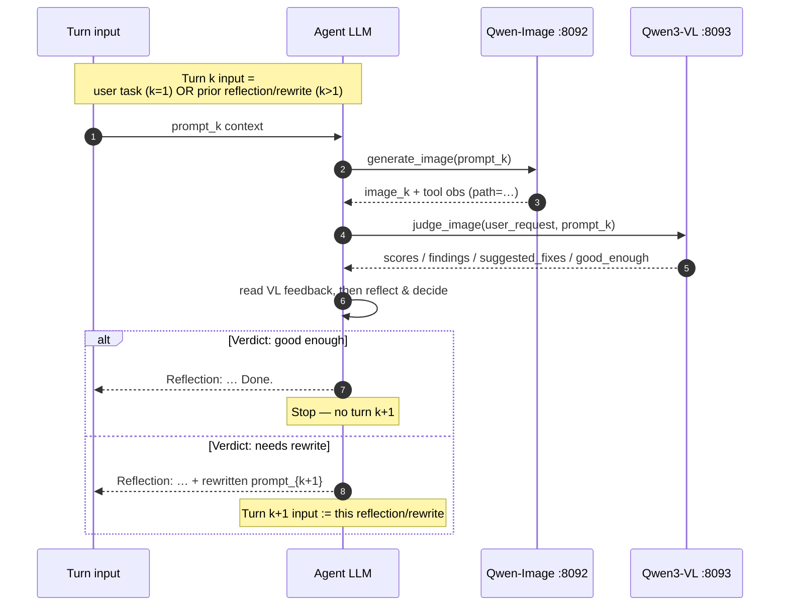
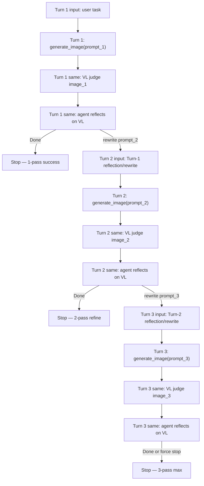

# Agentic LLM Trainer LoRA Overfitting

Last updated: 08/06/2026

Training recipes for **Mode (2a) Agentic LLM RL** ([#302](https://github.com/verl-project/verl-omni/issues/302)).

- **Mode (2a) GRPO** (`agent_llm/`): train `Qwen/Qwen3.5`.
- Frozen **Qwen-Image** is the external `generate_image` tool (`:8092`).
- Frozen **Qwen3-VL** sidecar (`:8093`) serves dual role: (1) in-turn
  `judge_image` tool called by the agent after every generation, and (2)
  `reward_correctness` / `reward_aesthetics` scorer at reward time.
- Reward: `pkg://verl_omni.utils.reward_score.agentic_reward` — parseable
  `<tool_call>` protocol (Hermes JSON **or** Qwen3.5 XML) with VL-grounded
  reflection + `Done.` (or rewrite for the next turn) gating.
- Actor wire format is auto-selected from `MODEL_PATH`:
  - **Qwen3-VL** → `multi_turn.format=hermes` + Hermes JSON fewshots
  - **Qwen3.5** → `multi_turn.format=qwen3_coder` + XML fewshots
  Override with `TOOL_PARSER_FORMAT` / `--tool_call_format`.

Target protocol (fewshot + on-policy) — see **Multi-turn Behaviors** diagrams:

```
Turn k:
  generate_image(prompt_k) → image_k
  judge_image(user_request, prompt_k) → VL feedback        ┐ same logical turn
  agent reads VL output, reflects, then decides:            ┘
    "Reflection: … Done."                                OR
    "Reflection: …" + rewritten generate_image(prompt_{k+1}) → Turn k+1 input
```

Fewshot demos in `create_dummy_agentic_data.py` should follow that order for all
three classes (1-pass / 2-pass / 3-pass). They are **GRPO exploration examples**,
not supervised targets. Regenerate parquet when switching actor family so fewshot
`<tool_call>` syntax matches the chat template.

## Reward components

`compute_score` returns a scalar `score` plus per-component fields logged to
WandB as `agentic_reward/<name>/mean` (via `agentic_metrics_manager.py`).


## Multi-turn Behaviors (three turns max)

**Target contract**:

1. Every logical turn starts with `generate_image(prompt_k)`.
2. In the **same** logical turn, after the image returns:
   - agent calls `judge_image(user_request, prompt_k)` → frozen Qwen3-VL (`:8093`) returns structured feedback;
   - agent reads that VL output, reflects, then either **`Done.`** or a **rewritten `generate_image`**.
3. The next turn’s **input** is that reflection / rewrite (not a bare image `tool_response`).
4. Branching stops at 1 / 2 / 3 turns based on the agent’s verdict (max 3 gens).

### One logical turn (generate → judge → reflect & decide)



### Branching: 1-pass / 2-pass / 3-pass (max)



### What “turn input” must carry

| Logical turn | Input to agent decode that emits `generate_image` | Same-turn after image |
| --- | --- | --- |
| 1 | User task (+ system / fewshot) | VL judge(`image_1`) → agent `Done.` **or** rewrite `prompt_2` |
| 2 | **Turn-1 reflection results** (VL summary + agent rewrite), not only the raw image obs | VL judge(`image_2`) → `Done.` **or** rewrite `prompt_3` |
| 3 | **Turn-2 reflection results** | VL judge(`image_3`) → `Done.` (cap) |

### Current rollout behavior

Each logical turn now follows the contract above:

- Turn k: `generate_image(prompt_k)` → `judge_image(user_request, prompt_k)` → agent reads VL feedback, reflects, then either `Done.` or rewrite + `generate_image(prompt_{k+1})`.
- Turn k+1 input is the agent's reflection/rewrite from turn k (not a bare image `tool_response`).

Verify that rollout trajectories show `judge_image` tool calls between each
`generate_image` and the agent's `Reflection: …` decision text.

### Primary fields (enter the weighted mix)

| Field | Default weight | Physical meaning | Zero when |
| --- | ---: | --- | --- |
| `reward_tool_call` | 0.10 | Binary: trajectory contains ≥1 parseable `<tool_call>`. **In scalar.** | No parseable tool call |
| `reward_brevity` | — | Short assistant prose (≤4 sentences / ≤280 chars). **Metric only.** | Long rambling / debate CoT |
| `reward_format` | — | Fraction of `generate_image` calls with valid arguments. **Metric only.** | No / malformed calls |
| `reward_reflection` | — | Quality of agent self-reflection prose. **Metric only.** | No reflection prose |
| `reward_tool_usage` | — | Protocol shape and distinct rewritten prompts. **Metric only.** | No `generate_image` |
| `reward_result` | — | Closed-loop outcome quality. **Metric only.** | No `generate_image` |
| `reward_correctness` | 0.45 | Frozen-VL correctness via `AGENTIC_REFLECT_VLM_URL` on last image. **In scalar.** | URL unset / VL call fails |
| `reward_aesthetics` | 0.45 | Frozen-VL aesthetics via `AGENTIC_REFLECT_VLM_URL` on last image. **In scalar.** | URL unset / VL call fails |

Weighted mix (then scaled by a protocol tier `base + scale * mix`):

```text
mix = Σ w_i * reward_i  /  Σ w_i
score = base + scale * mix
```

| Protocol tier | Condition | `base` | `scale` | `protocol_ok` |
| --- | --- | ---: | ---: | ---: |
| Closed + high C/A | reflection prose + `Done.`, single-pass or distinct rewrite, C/A ≥ 0.70 | 0.10 | 0.90 | 1 |
| Closed, VL down / weak C/A | closed loop; VL missing or C/A &lt; 0.70 | 0.05 | 0.65 | 1 / 0 |
| Reflection present | ≥1 `generate_image` + reflection prose, not fully closed | 0.05 | 0.45 | 0 |
| Gen-only (starved) | ≥1 `generate_image`, **no** reflection prose | 0.02 | 0.03 | 0 |

Weights are stored per row in parquet `ground_truth` / `extra_info` (`w_tool_call`,
`w_correctness`, `w_aesthetics`). Brevity, format, reflection, tool_usage, and
result are logged as metrics but excluded from the scalar reward (saturated from
step 1).

### Visual rubric diagnostics

| Field | Physical meaning |
| --- | --- |
| `reward_correctness_{subject_entities,attributes,relations_layout,scene_context,completeness}` | Five frozen-VL correctness answers |
| `reward_aesthetics_{composition,lighting,color,fidelity,appeal}` | Five frozen-VL aesthetics answers |
| `protocol_ok` | 1 iff closed loop (reflection + Done, single or distinct rewrite) |
| `num_hermes_tool_calls` | Legacy field name: count of parseable JSON/XML `<tool_call>` blocks |
| `num_generate_image_prompts` | Count of `generate_image` prompts |
| `num_judge_image_calls` | Count of `judge_image` tool calls in the trajectory |

## Prerequisites

- Launch from the **verl-omni repo root** (repo-relative `function_tool_path`).
  `run_agentic_grpo.sh` auto-`cd`s to the repo root.
- Set **`MODEL_PATH`** to a Qwen3-VL Instruct (or Thinking) snapshot.
- Prefer **2 free GPUs** for GRPO, **2 GPUs** for Qwen-Image, **1 GPU** for the
  reflect VLM sidecar.
- The launcher verifies the native Hermes tool template and image processor
  before allocating training workers.

## 100-step overfit e2e (recommended)

Goal: overfit a tiny prompt pool so the policy learns
**`generate_image` → (inspect image) → Done. or rewrite + generate_image**.

### 1) Operator env (example)

```bash
source ~/fred/fred_verlomni_agentic_multiturn_pr1.sh   # or your local env
export CUDA_VISIBLE_DEVICES=3,4   # train GPUs; keep 0,1 for image and another for reflect
export MODEL_PATH=.../Qwen3-VL-2B-Instruct/...
export TRAIN_FILE=$PWD/data/agentic/train.parquet
export VAL_FILE=$PWD/data/agentic/val.parquet
```

### 2) Start frozen tools

Pane A — Qwen-Image (`generate_image`):

```bash
CUDA_VISIBLE_DEVICES=0,1 \
  QWEN_IMAGE_MEMORY_MODE=balanced \
  bash examples/agenticrpco_trainer/agent_llm/run_qwen_image_tool_server.sh
# trainer: export AGENTIC_QWEN_IMAGE_URL=http://127.0.0.1:8092/generate
```

Pane B — judge VLM sidecar (agent `judge_image` tool + reward scorer):

```bash
CUDA_VISIBLE_DEVICES=2 \
  bash examples/agenticrpco_trainer/agent_llm/run_qwen_vl_reflect_server.sh
# trainer: export AGENTIC_REFLECT_VLM_URL=http://127.0.0.1:8093/reflect
```

Restart the reflect server after rubric upgrades (e.g. 10-question rubric). If
scores stay stuck at ~0.95/0.92 without `correctness_scores` fields, the old
single-score process is still running.

If C/A rewards stay at 0, check that `AGENTIC_REFLECT_VLM_URL` is set and the
sidecar is healthy — the actor calls `judge_image` after every `generate_image`.

Memory modes for Qwen-Image:

- `balanced`: split BF16 modules across **2+** visible GPUs.
- `full` / `model_offload` / `sequential_offload` / `mmdit_nf4`: see script help.

Without an image service, `generate_image` returns a text stub. Set
`REQUIRE_REAL_IMAGE_TOOL=0` only for plumbing diagnostics.

### 3) Run GRPO — pane C

```bash
TOTAL_STEPS=100 \
  N_GPUS=2 \
  OVERFIT_DATA=1 \
  bash examples/agenticrpco_trainer/agent_llm/run_agentic_grpo.sh
```

| Step | Behavior |
| --- | --- |
| Template | Qwen3-VL native Hermes JSON tool template |
| Data | `TRAIN_FILE` / `VAL_FILE` (defaults: `data/agentic/{train,val}.parquet`) |
| Agent loop | Stock verl `tool_agent` — no force / teacher token replacement |
| Tools | `diffusion_tool.py`: `generate_image` only |
| Observation | PIL pixels + `image_vis` facts; actor self-reflects |
| Reward | See tables above; frozen VL judges C/A offline via HTTP |
| Artifacts | `outputs/e2e/<experiment>/{rollout_trajectories,rollout_images,hermes_actions}/` |

Inspect learning:

```bash
# Valid <tool_call> blocks; agent reflection + Done. (or rewrite) after generate_image.
ls outputs/e2e/qwen3_vl_agentic_grpo_*/hermes_actions/
ls outputs/e2e/qwen3_vl_agentic_grpo_*/rollout_trajectories/step_*/
```

### Data-only refresh (no train)

```bash
python3 examples/agenticrpco_trainer/data_process/create_dummy_agentic_data.py \
  --local_save_dir data/agentic \
  --overfit --train_size 8 --val_size 2
```

Each row embeds one class demo:

| Class | Demo trajectory |
| ---: | --- |
| 0 | `generate` → Reflection + Done |
| 1 | `generate` → Reflection + rewrite `generate` → Reflection + Done |
| 2 | three `generate` / reflection-rewrite passes until Reflection + Done |

Then the live user turn (with brevity reminder). Runtime calls remain on-policy.

## File map

```
examples/agenticrpco_trainer/agent_llm/
├── qwen_image_tool_server.py
├── run_qwen_image_tool_server.sh
├── qwen_vl_reflect_server.py
├── run_qwen_vl_reflect_server.sh
├── run_agentic_grpo.sh
├── check_overfit_gates.py
└── run_lance_frozen_diffusion_tool_server.sh   # legacy Lance backend (optional)

verl_omni/agent_loop/
├── diffusion_tool.py                    # generate_image (attach image for self-reflect)
├── agentic_metrics_manager.py           # Stock manager + raw rollout/reward logs
├── agentic_image_reflection.py          # Supplemental image measurements
└── agentic_trajectory_context.py        # Artifact path helpers

verl_omni/utils/reward_score/agentic_reward.py
verl_omni/utils/reward_score/vl_reflect_client.py   # Frozen VL HTTP for C/A reward
examples/agenticrpco_trainer/data_process/create_dummy_agentic_data.py
```

Frozen image backends in `diffusion_tool.py` (first match wins):

1. `AGENTIC_QWEN_IMAGE_URL` — bundled Qwen-Image service
2. `AGENTIC_DIFFUSION_TOOL_URL` — generic POST `{"prompt"}` → image/text
3. `AGENTIC_LANCE_SERVER_URL` — legacy Lance backend
4. unset — text stub

Reflect backend (reward judge only; via `vl_reflect_client.call_reflect_vlm`):

1. `AGENTIC_REFLECT_VLM_URL` — frozen Qwen3-VL sidecar (`POST /reflect`)
2. unset / failure — C/A rewards are 0.0 (no heuristic fallback for reward)
